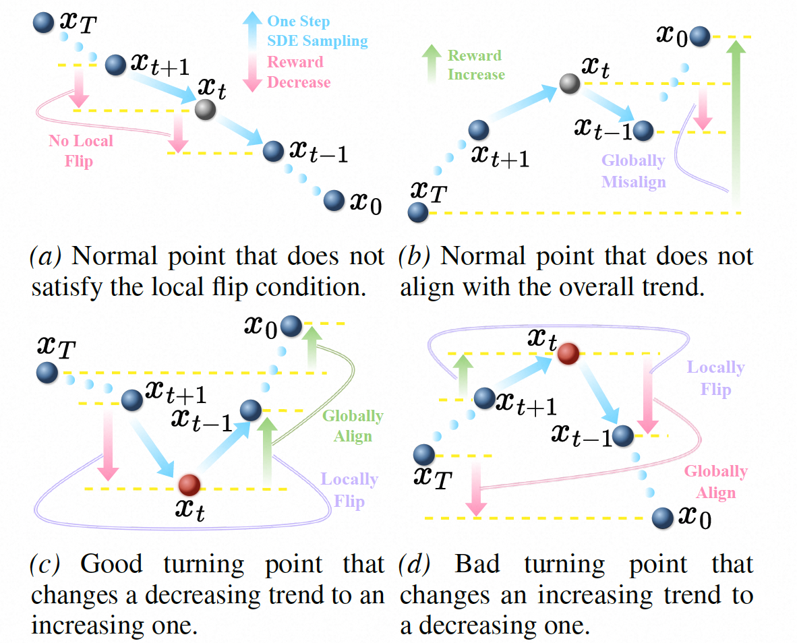
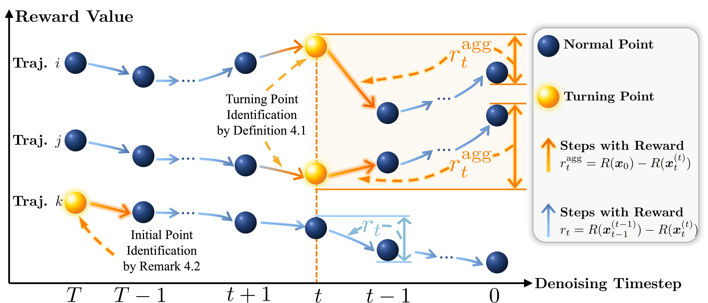

# Alleviating Sparse Rewards by Modeling Step-Wise and Long-Term Sampling Effects in Flow-Based GRPO

<p align="center">
  <a href="http://arxiv.org/abs/2602.06422"></a>
  <a href="#"></a>
  <a href="#license"></a>
</p>

<p align="center">
  <a href="https://yunzetong.github.io"><strong>Yunze Tong</strong></a><sup>1</sup>,
  <a href="https://xiaobul.github.io"><strong>Mushui Liu</strong></a><sup>1,2</sup>,
  <strong>Canyu Zhao</strong><sup>1</sup>,
  <strong>Wanggui He</strong><sup>2</sup>,
  <strong>Shiyi Zhang</strong><sup>3</sup>,
  <strong>Hongwei Zhang</strong><sup>1</sup>,
  <strong>Jinlong Liu</strong><sup>2</sup>,
  <strong>Ju Huang</strong><sup>2</sup>,
  <strong>Jiamang Wang</strong><sup>2</sup>,
  <strong>Hao Jiang</strong><sup>2&dagger;</sup>,
  <strong>Pipei Huang</strong><sup>2</sup>
</p>

<p align="center">
  <sup>1</sup>Zhejiang University,
  <sup>2</sup>Alibaba Group,
  <sup>3</sup>Tsinghua University
</p>

<p align="center">
  <sup>*</sup>Equal contribution,
  <sup>&dagger;</sup>Corresponding author
</p>

---

## Abstract

Deploying GRPO on Flow Matching models has proven effective for text-to-image generation. However, existing paradigms typically propagate an outcome-based reward to all preceding denoising steps without distinguishing the local effect of each step. Moreover, current group-wise ranking mainly compares trajectories at matched timesteps and ignores within-trajectory dependencies, where certain early denoising actions can affect later states via delayed, implicit interactions. To address these issues, we propose TurningPoint-GRPO (TP-GRPO), a GRPO framework that alleviates step-wise reward sparsity and explicitly models long-term effects within the denoising trajectory. TP-GRPO makes two key innovations: (i) it replaces outcome-based rewards with step-level incremental rewards, providing a dense, step-aware learning signal that better isolates each denoising action’s ``pure" effect, and (ii) it identifies turning points—steps that flip the local reward trend and make subsequent reward evolution consistent with the overall trajectory trend—and assigns these actions an aggregated long-term reward to capture their delayed impact. Turning points are detected solely via sign changes in incremental rewards, making TP-GRPO efficient and hyperparameter-free. Extensive experiments also demonstrate that TP-GRPO exploits reward signals more effectively and consistently improves generation.

---

## Method Overview

### Illustrative Cases of Normal Points and Turning Points
<p align="center">
  
</p>

### Method Illustration
<p align="center">
  
</p>

---

## Results

<p align="center">
  
</p>

---

## Updates

- **[2026.02]** Initial release of the codebase.
- **[2026.02]** Paper available on arXiv.

---

## TODO

- [x] Code migration and release
- [ ] Verify training scripts and environment setup

## Installation

### Requirements

- Python >= 3.10
- PyTorch >= 2.0
- CUDA >= 12.8

### Setup

```bash
# Clone the repository
git clone https://github.com/YunzeTong/TurningPoint-GRPO.git
cd TurningPoint-GRPO

# Create conda environment (recommended)
conda create -n tp-grpo python=3.10.13 -y
conda activate tp-grpo

# Install PyTorch (adjust according to your CUDA version)
pip install torch torchvision torchaudio --index-url https://download.pytorch.org/whl/cu128

# Install dependencies
pip install -r requirements.txt
```

---

## Training

We provide training scripts for both single-node and multi-node setups.

### Configuration Options

| Parameter | Options | Description |
|-----------|---------|-------------|
| `MODEL_NAME` | `sd3`, `flux` | Base model architecture |
| `REWARD` | `pickscore`, `geneval`, `general_ocr` | Reward function |
| `NUM_GPUS` | int (default: `8`) | Number of GPUs (single-node) |

### Single-Node Training

#### Flow-GRPO (Baseline)

```bash
# Default configuration (flux + pickscore)
bash scripts/single_node/common_normal.sh
```

#### TP-GRPO (Ours)

```bash
# Default configuration (sd3 + pickscore)
bash scripts/single_node/common_op3.sh
```

### Multi-Node Training

For distributed training across multiple nodes, execute the following on each node:

#### Flow-GRPO (Baseline)

```bash
# On each node (replace <RANK> with 0, 1, 2, 3, ...)
MASTER_ADDR=<master_node_ip> MODEL_NAME=flux REWARD=pickscore \
    bash scripts/multi_node/common_normal.sh <RANK>
```

#### TP-GRPO (Ours)

```bash
# On each node (replace <RANK> with 0, 1, 2, 3, ...)
MASTER_ADDR=<master_node_ip> MODEL_NAME=sd3 REWARD=pickscore \
    bash scripts/multi_node/common_op3.sh <RANK>
```

#### Multi-Node Configuration

| Parameter | Options | Description |
|-----------|---------|-------------|
| `NUM_MACHINES` | int (default: `4`) | Number of nodes |
| `NUM_PROCESSES` | int (default: `32`) | Total GPUs across all nodes |
| `MASTER_ADDR` | IP address | Master node IP |
| `MASTER_PORT` | int (default: `19001`) | Communication port |

**Example**: 4-node training with 8 GPUs per node

```bash
# Node 0 (Master)
MASTER_ADDR=10.0.0.1 NUM_MACHINES=4 NUM_PROCESSES=32 \
    bash scripts/multi_node/common_op3.sh 0

# Node 1
MASTER_ADDR=10.0.0.1 NUM_MACHINES=4 NUM_PROCESSES=32 \
    bash scripts/multi_node/common_op3.sh 1

# Node 2
MASTER_ADDR=10.0.0.1 NUM_MACHINES=4 NUM_PROCESSES=32 \
    bash scripts/multi_node/common_op3.sh 2

# Node 3
MASTER_ADDR=10.0.0.1 NUM_MACHINES=4 NUM_PROCESSES=32 \
    bash scripts/multi_node/common_op3.sh 3
```

---

## License

This project is licensed under the Apache License 2.0 - see the [LICENSE](LICENSE) file for details.

---

## Acknowledgements

This codebase is built upon [Flow-GRPO](https://github.com/yifan123/flow_grpo). We sincerely thank the authors for their excellent work and open-source contribution. We also thank the creators of reward models used in our work, including [PickScore](https://huggingface.co/yuvalkirstain/PickScore_v1), [ImageReward](https://huggingface.co/THUDM/ImageReward), [GenEval](https://github.com/djghosh13/geneval), [DeQA](https://huggingface.co/zhiyuanyou/DeQA-Score-Mix3), [UnifiedReward](https://huggingface.co/CodeGoat24/UnifiedReward-qwen-7b).

---

## Citation

If you find this work useful for your research, please consider citing our paper:

```bibtex
@misc{tong2026alleviatingsparserewardsmodeling,
      title={Alleviating Sparse Rewards by Modeling Step-Wise and Long-Term Sampling Effects in Flow-Based GRPO}, 
      author={Yunze Tong and Mushui Liu and Canyu Zhao and Wanggui He and Shiyi Zhang and Hongwei Zhang and Peng Zhang and Jinlong Liu and Ju Huang and Jiamang Wang and Hao Jiang and Pipei Huang},
      year={2026},
      eprint={2602.06422},
      archivePrefix={arXiv},
      primaryClass={cs.CV},
      url={https://arxiv.org/abs/2602.06422}, 
}
```

---

## Contact

For questions or discussions, please open an issue or contact tyz01@zju.edu.cn.
